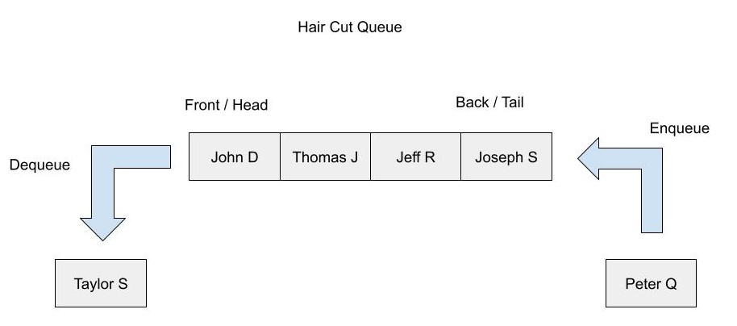

# Queues in C#


## Definition

C# queue contains elements in precisely the order they were added, with objects added at one end and removed from the opposite end.


    
> Queues are vital for technology we have. Without queues printers wouldn't be able to keep a list all papers needed that are needed to be print, call centers wouldn't be able to handle phone calls, and various issues would arise.

## Common examples of queues

### Real life examples:
* Ticket line 
* Car Wash 
* single-lane one-way road


### Examples in technology:
* Printers
* Input streams
* Routers and switches
* Message Buffering

## Queue operations

| <font size="4">Methods</font> | <font size="4">Usage</font>                                                    |
|-------------------------------|--------------------------------------------------------------------------------|
| Enqueue(T)                    | Adds an item into the queue.                                                   |
| Dequeue                       | Returns an item from the beginning of the queue and removes it from the queue. |
| Peek()                        | Returns an first item from the queue without removing it.                      |
| Contains(T)                   | Checks whether an item is in the queue or not.                                 |
| Clear()                       | Removes all the items from the queue.                                          |
| Count                         | Returns the total count of elements in the Queue.                              |


## Efficiency of queues


| <font size="4">Methods</font> | <font size="4">Efficiency</font> |
|-------------------------------|----------------------------------|
| Enqueue(T)                    | O(1)                             |
| Dequeue                       | O(1)                             |
| Peek()                        | O(1)                             |
| Contains(T)                   | O(1)                             |
| Clear()                       | O(1)                             |
| Count                         | O(1)                             |

    

### Creating a queue
```csharp
Queue<int> queue = new Queue<int>();
```

### Adding to queue
```csharp
queue.Enqueue(1);
queue.Enqueue(2);
queue.Enqueue(3);
queue.Enqueue(4);
```

### Retrieving elements from queue
```csharp
queue.Dequeue(); // removes and returns first element (1)
// Queue: 2, 3, 4
```

### Peek
```csharp
// Queue: 2, 3, 4
queue.Peek() // retrieves first elements (2)
// Queue: 2, 3, 4
```

### Contains
```csharp
// Queue: 2, 3, 4
queue.Contains(2) // true
```

### Count
```csharp
// Queue: 2, 3, 4
queue.Count() // returns 3
```

### Clear
```csharp
// Queue: 2, 3, 4
queue.Clear() // queue is now empty
// Queue: 
```


## Queues Example: Haircut Queue
Below is an example of a queue in C#. It is a queue of people to get a hair cut. In this example we add people to the back of the queue to get in line for their hair cut. Then as we serve a customer we remove them from the queue. 



> #### <a href="https://github.com/BYUI-CSE212-W23-01/final-project-atk21009/tree/main/C%23%20Files/Examples/QueueExample">Project Link</a>

### HairCut.cs
    We store the first name and the last initial of people and add them to the queue. We also create a function to serve the customer.
```csharp
public class HairCut {
    private string _fName;
    private string _lName;

    public HairCut(string fName, string lName) {
        _fName = fName;
        _lName = lName;
    }

    override public string ToString() {
        return $"{_fName} {_lName}";
    }
    

    public void ServeCustomer() {
        Console.WriteLine($"{this._fName} {this._lName} has received a hair cut");
    }
    
}
```
### Program.cs
    In this file we create a queue and add several people to the queue to receive a haircut, then we serve two customers.
    
    
```csharp
public static class Program
{
    public static void Run()
    {
        Queue<HairCut> hairCutQueue = new Queue<HairCut>();

        HairCut task = new HairCut("Taylor", "S");
        hairCutQueue.Enqueue(task);
        task = new HairCut("John", "D");
        hairCutQueue.Enqueue(task);
        task = new HairCut("Thomas", "J");
        hairCutQueue.Enqueue(task);
        task = new HairCut("Jeff", "R");
        hairCutQueue.Enqueue(task);
        task = new HairCut("Joseph", "S");
        hairCutQueue.Enqueue(task);
        task = new HairCut("Peter", "Q");
        hairCutQueue.Enqueue(task);

        Console.WriteLine(string.Join(", ", hairCutQueue)); // Taylor S, John D, Thomas J, Jeff R, Joseph S, Peter Q
        
        HairCut serve = hairCutQueue.Dequeue(); 
        serve.ServeCustomer();
        serve = hairCutQueue.Dequeue();
        serve.ServeCustomer();
        
        Console.WriteLine(string.Join(", ", hairCutQueue)); // Thomas J, Jeff R, Joseph S, Peter Q


    }
}
```

### Output
    Taylor S, John D, Thomas J, Jeff R, Joseph S, Peter Q
    Taylor S has received a hair cut
    John D has received a hair cut
    Thomas J, Jeff R, Joseph S, Peter Q

## Queue Problem: Exercise Queue

Write a program to keep track of your workout. In this problem the user should have a input system in which they can either add to the queue, complete an exercise, or quit the program when they are done.
The program should print of the current queue each time a option is picked.


> #### <a href="https://github.com/BYUI-CSE212-W23-01/final-project-atk21009/tree/main/C%23%20Files/Problems/QueueProblem">Problem Solution Link</a>

## Additional Info
For additional information about queues, and different examples check out <a href="https://learn.microsoft.com/en-us/dotnet/api/system.collections.generic.queue-1?view=net-7.0">Microsoft Learn</a>. In which they go into more depth, and give additional examples.


