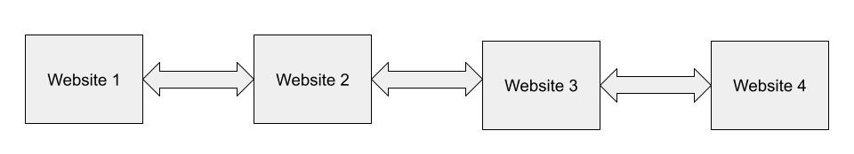

# Linked Lists in C#

## Definition
A linked list is a linear collection of data elements whose order is not given by their physical placement in memory. Instead, each element points to the next. It is a data structure consisting of a collection of nodes which together represent a sequence.


## Common examples of Linked Lists
* Previous and next page in a web browser
* Spotify / Apple music in queue

## Terms
| <font size="4">Methods</font> | <font size="4">Definitions</font>                                                        |
|-------------------------------|------------------------------------------------------------------------------------------|
| Head                          | The head refers to the first Node in the linked list                                     |
| Tail                          | The Tail refers to the last node in the linked list                                      |
| Node                          | A node is a data set in which the node contains the data, next, and previous information |
| Next                          | The next information refers the the next node in the linked list                         |
| Prev                          | The previous information refers to the previous node in the linked list                  |
| Data                          | The data refers to the information being stored in the node                              |
| LinkedList<T>()               | Initializes a new instance of the LinkedList<T> class that is empty.                     |

## Efficiency of Linked Lists
    - The efficiency of Linked Lists are O(n)
        - The efficiency of Linked Lists are O(n) because most of the methods loop over the entire list before finding the correct node.
| <font size="4">Methods</font> | <font size="4">Efficency</font> |
|-------------------------------|---------------------------------|
| Head                          | O(1)                            |
| Tail                          | O(1)                            |
| Node                          | O(N)                            |
| Next                          | O(N)                            |
| Prev                          | O(N)                            |
| Data                          | O(N)                            |
| LinkedList<T>()               | O(1)                            |


## Linked Lists Example: Music Queue
Spotify and Apple music use linked lists to keep track of what a user has listened to and what they have queued. Through this we are able to traverse through songs we just listened to and songs that we have queued for us. Below is an example of how a linked list might look for this.

> #### <a href="https://github.com/BYUI-CSE212-W23-01/final-project-atk21009/tree/main/C%23%20Files/Examples/LinkedListExample">Project Link</a>

### Linked List
```csharp
public class LinkedList: IEnumerable<string>
{
    private Node? _head;
    private Node? _tail;

    public void InsertTail(string song)
    {
        Node newNode = new Node(song);
        if (_head is null)
        {
            _head = newNode;
            _tail = newNode;
        }
        else
        {
            newNode.Prev = _tail;
            _tail!.Next = newNode;
            _tail = newNode;
        }
    }
    
    public void InsertAfter(string song, string newSong)
    {
        Node? curr = _head;
        while (curr is not null)
        {
            if (curr.Song == song)
            {
                if (curr == _tail)
                {
                    InsertTail(newSong);
                }
                else
                {
                    Node newNode = new Node(newSong);
                    newNode.Prev = curr;
                    newNode.Next = curr.Next;
                    curr.Next!.Prev = newNode;
                    curr.Next = newNode;
                }
                return;
            }
            curr = curr.Next;
        }
    }

    public IEnumerator<string> GetEnumerator()
    {
        var curr = _head;
        while (curr is not null)
        {
            yield return curr.Song;
            curr = curr.Next;
        }
    }

    IEnumerator IEnumerable.GetEnumerator()
    {
        return this.GetEnumerator();
    }
    
    public override string ToString() {
        return "<LinkedList>{" + string.Join(", ", this) + "}";
    }
}
```

### LinkedListTester
```csharp
public static class LinkedListTester
{
    public static void Run()
    {
        var ll = new LinkedList();
        ll.InsertTail("Baby");
        ll.InsertTail("We Are Young");
        ll.InsertTail("Dancing Queen");
        ll.InsertTail("My House");
        
        Console.WriteLine(ll.ToString()); // <LinkedList>{Baby, We Are Young, Dancing Queen, My House}
        
        ll.InsertAfter("We Are Young", "Riptide");
        ll.InsertAfter("Dancing Queen", "Little Talks");
        
        Console.WriteLine(ll.ToString()); // <LinkedList>{Baby, We Are Young, Riptide, Dancing Queen, Little Talks, My House}
    } 
    
}
```
### Node
```csharp
public class Node 
{
    public string Song { get; set; }
    public Node? Next { get; set; }
    public Node? Prev { get; set; }

    public Node(string song)
    {
        this.Song = song;
    }
}
```

### Output

    <LinkedList>{Baby, We Are Young, Dancing Queen, My House}
    <LinkedList>{Baby, We Are Young, Riptide, Dancing Queen, Little Talks, My House}


## Linked List Problem: Search History
Now try it for yourself. Below is a problem in which animal names are added to a linked list. Using your knowledge of linked lists and additional resources try to solve the problems below.

### Problem Description
This project is a representative of internet search history. In which we are able to traverse forwards and backwards on our list to visit different sites. We use various methods to add, remove, clear, etc to our linked list. We are able to represent our search history with linked lists and traverse through our search history.


> Above is an image how the first 4 websites should look like when entered. The websites should point to one another so that the user can traverse forward and backwards between their website history.


> #### <a href="https://github.com/BYUI-CSE212-W23-01/final-project-atk21009/tree/main/C%23%20Files/ProblemTemplates/LinkedListProblemTemplate">Problem Template</a>

> #### <a href="https://github.com/BYUI-CSE212-W23-01/final-project-atk21009/tree/main/C%23%20Files/Problems/LinkedListProblem">Problem Solution Link</a>


## Additional Info
For additional information about Linked Lists, and different examples check out <a href="https://learn.microsoft.com/en-us/dotnet/api/system.collections.generic.linkedlist-1?view=net-7.0">Microsoft Learn</a>. In which they go into more depth, and give additional examples.
